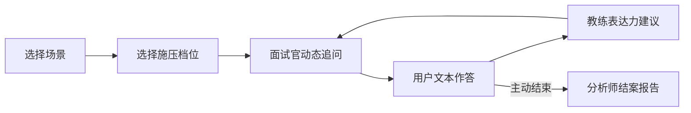
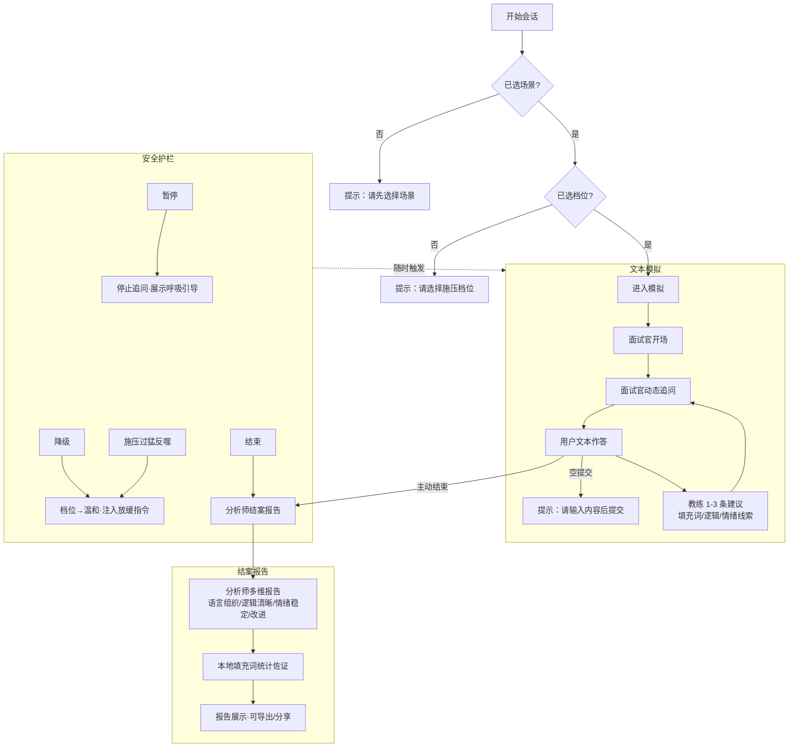

# MindForge（心智锻造）产品需求文档（PRD）

> 版本：v1.0（MVP 范围）
> 视角：教育科技 × 心理健康领域资深 AI 产品经理
> 配套文档：`MindForge_产品需求验证报告.md`、`MindForge_技术方案_AI技术选型.md`、`MindForge_技术方案_AI技术选型.md`

---

## 1. 产品背景与定位

### 1.1 背景与痛点
求职、考研复试、公考、答辩是国人焦虑浓度最高的场景，用户基数以千万计。现有工具要么替招聘方做筛选（企业侧 AI 面试官），要么帮候选人"答对题/押题"（候选侧 AI 工具），**几乎没有产品从"心理脱敏 + 表达力即时教练"角度服务用户**。用户真实且巨大的需求长期未被满足。

### 1.2 战略 Pivot（关键定位决策）
> **不做"AI 面试模拟器"（红海 + 监管焦点），做"高压时刻的心理韧性与表达力训练器"。**

把"面试官施压"作为**可调节强度的训练模块**，把**教练（即时反馈）**与**分析师（成长报告）**作为产品灵魂。立场反转——不为"评判/筛选"用户，而为"赋能"用户。

### 1.3 核心价值定位（交叉空白）
**「高压心理脱敏 × 表达力即时教练 × 结构化成长报告」**——这一交叉维度基本无人占据，是 MindForge 必须死守的制高点，而非去和题库类产品拼覆盖率。

### 1.4 战略级护城河：监管风险显著低于企业侧 AI
MindForge 是**训练工具、不做招聘决策**。中国 1–2 年内或出台招聘 AI 管理规定（欧盟 AI Act 已将招聘 AI 列高风险），而"为用户赋能"的训练属性天然规避高风险归类。这是应**主动对外强调**的护城河，而非被动合规。

### 1.5 切入垂直
第一刀切**考研复试 + 校招面试**：规模最大、痛点最 acute、付费动机最强，且高校就业中心 / 考研机构可作为 B2B2C 渠道。

---

## 2. 目标用户画像

### 2.1 核心切入人群（本期）

| 细分人群 | 规模（年） | 痛点强度 | 付费意愿 | 核心特征 |
|---|---|---|---|---|
| **考研复试学生** | 考研报名 388 万（2025），约 1/3 进复试 | 高 | 中 | 复试淘汰率高、临场表达定生死；"上岸"强驱动 |
| **校招面试求职者** | 2025 届毕业生 1222 万、2026 届预计 1270 万 | 极高 | 中高 | 群体最庞大、焦虑最普遍；"00 后"全面进场 |

### 2.2 数据锚点（说服力背书）
- 2025 届高校毕业生 **1222 万**、2026 届预计 **1270 万**；
- 2025 考研报名 **388 万**；
- 2026 国考过审 **371.8 万**、报录比 **98:1**；
- 中国超 70% 中大型企业校招已用 AI，2026 春招超 700 家企业大规模启用 AI 面试官（用户教育成本已被大厂"免费"完成）。

### 2.3 用户核心动机
- **考研复试**：临场表达直接决定录取，愿为"确定性"付费。
- **校招面试**：短期高频（收到通知→面试前 1–7 天，每天 1–3 次），需要真实模拟 + 即时纠错 + 报告。

### 2.4 使用场景与频率
| 场景 | 时机 | 频率 | 产品诉求 |
|---|---|---|---|
| 面试/复试前冲刺 | 考前 1–7 天 | 短期高频 | 真实模拟 + 即时纠错 + 报告 |
| 考前夜 | 考前 1–3 天 | 爆发式 | 高压脱敏、稳定情绪 |

---

## 3. 业务核心逻辑

**一句话**：选择场景 → 选择施压档位 → 面试官追问 → 用户作答 → 教练建议（循环）→ 结束 → 结案报告。

---

## 4. 功能流程描述

---

## 5. 功能需求详情

### FR-01 场景选择
- 提供「考研复试」「校招面试」两个场景（本期先 1–2 个）。
- 每个场景含预设角色设定与高频高压问题库。
- 未选择场景时禁止进入模拟，给出明确提示。

### FR-02 施压档位（三档）
- **温和**：语气平和、追问温和、多正向鼓励。
- **标准**：专业平稳、适度追问与质疑。
- **高压**：冷峻、连续追问、制造沉默压力、偶尔打断，但**绝不人身攻击/侮辱**。
- 档位作为变量注入面试官 system prompt；服务端校验档位**不可被模型自主上调**。

### FR-03 面试官动态追问
- 开场白 + 基于用户作答的动态追问，每次只问一个问题，保持高压对话节奏。
- 流式输出（快模型），首字 < 2s。
- 严格单轮单角色发言，保证角色一致性。

### FR-04 教练表达力建议
- 每轮用户作答后，给出 **1–3 条**建议，覆盖：
  - **填充词**：嗯/啊/然后/就是说等频次；
  - **逻辑**：分点、衔接、跑题线索；
  - **情绪线索**：紧张/回避等文本信号。
- 指标 90% 由前端/后端正则统计现算（零推理成本），LLM 仅补定性建议。

### FR-05 分析师结案多维报告
- 结束会话后，强模型基于全量对话历史 + 累计指标**事后生成**（< 10s，与对话互不干扰）。
- 维度：**语言组织 / 逻辑清晰度 / 情绪稳定性 / 改进建议**。
- 本地填充词统计作为客观佐证一并展示，报告可导出/分享。

### FR-06 安全护栏（暂停 / 降级 / 结束）
- **暂停**：停止面试官追问，界面展示呼吸引导/安抚语，可随时恢复。
- **降级**：档位立即切到温和并注入"放缓"指令。
- **结束**：触发分析师报告，会话归档。
- 教练侧栏始终以建设性+支持性语气对冲面试官冷峻。
- 硬性上限：单次会话最长时长、最大轮次，到点自动降级并提示休息。
- **施压过猛反噬**：命中外露焦虑/退出信号 → 前端弹窗"需要降低强度吗？"一键降级/暂停，并展示支持资源（非医疗建议）。

### FR-07 填充词正则统计
- 无外部依赖，前端/后端正则统计：填充词频次、平均句长、停顿/语速估算。
- 实时展示于教练面板，含颜色阈值（绿/黄/红）。

### FR-08 帮助中心
- 说明产品定位、使用流程、施压机制、安全护栏、数据隐私（本地优先、可删除）。
- 明确"训练工具、非招聘决策"的定位与监管护城河说明。

---

## 6. 非功能需求

| 类别 | 需求 |
|---|---|
| **性能** | 流式首字 < 2s；结案报告生成 < 10s；首屏 < 2s |
| **模型分工** | 对话用快模型流式输出；报告用强模型事后生成，二者互不干扰 |
| **角色一致性** | 单轮单角色发言机制，避免多角色互相污染 |
| **兼容性** | 主流浏览器（Chrome/Edge 优先）+ 响应式布局 |
| **隐私 by design** | 本地处理优先、不存原始音频、数据可删除 |
| **存储** | 本地优先存储（localStorage），报告可导出 |
| **可用性** | 所有异常场景有明确、友好的用户提示（见第 7 节） |

---

## 7. 验收标准（GIVEN-WHEN-THEN）

**AC-01 场景/档位前置校验**
- GIVEN 用户未选择场景
- WHEN 点击"开始模拟"
- THEN 系统提示"请先选择场景"并阻止进入

**AC-02 档位必选**
- GIVEN 用户已选场景但未选档位
- WHEN 点击"开始模拟"
- THEN 系统提示"请选择施压档位"

**AC-03 空提交拦截**
- GIVEN 用户在对话框空白
- WHEN 点击"发送"
- THEN 系统提示"请输入内容后提交"，不调用模型

**AC-04 流式首字性能**
- GIVEN 用户已正常进入模拟
- WHEN 面试官开始生成回复
- THEN 首字出现在 2s 内

**AC-05 AI 输出异常/中断**
- GIVEN 模型返回异常或连接中断
- WHEN 对话进行中
- THEN 前端展示"生成出错，请重试"并提供重试按钮，不崩溃、不丢上下文

**AC-06 网络超时**
- GIVEN 请求超过设定超时阈值
- WHEN 等待模型响应
- THEN 前端提示"网络超时，请检查网络后重试"并保留已输入内容

**AC-07 超长会话上下文压缩**
- GIVEN 对话轮次超过阈值（如 40 轮）
- WHEN 继续对话
- THEN 后端对历史做总结压缩后传入模型，保证角色一致性与性能

**AC-08 施压过猛反噬降级**
- GIVEN 当前档位为"高压"
- WHEN 用户文本命中外露焦虑/退出信号（如"我不行了/想退出"）
- THEN 前端弹窗建议降级/暂停，用户确认后档位切"温和"并注入放缓指令

**AC-09 安全护栏可用**
- GIVEN 会话进行中
- WHEN 用户点击"暂停/降级/结束"
- THEN 分别对应停止追问/切温和/触发报告，且模型无法越权上调档位

**AC-10 结案报告**
- GIVEN 用户正常结束会话
- WHEN 触发分析师
- THEN 10s 内生成含四维 + 本地填充词统计的报告，可导出

**AC-11 报告性能隔离**
- GIVEN 正在进行对话
- WHEN 生成结案报告
- THEN 报告生成不阻塞对话流，二者互不干扰

**AC-12 隐私与本地存储**
- GIVEN 用户完成会话
- WHEN 查看/导出数据
- THEN 原始音频不被存储，对话与指标存于本地且可删除

---

## 8. 技术方案概要

### 8.1 本期范围（MVP）
- **前端**：单页 Web（原生 HTML+JS 或轻框架），聊天式界面。
- **后端**：FastAPI + Uvicorn，封装大模型 API（OpenAI 兼容 / 国产模型，如 DeepSeek）。
- **编排**：单模型多角色提示词（面试官/教练/分析师），对话历史作为共享上下文（黑板）。
- **指标**：前端/后端正则统计填充词频次与平均句长，无外部依赖。
- **不做**：实时语音 ASR、语音情绪识别 SER、微表情、账号/支付；重量级多智能体框架（CrewAI/LangGraph）后置。

### 8.2 架构要点
- 浏览器 → 单页 Web 前端（聊天界面）→ FastAPI 后端（单模型多角色提示词编排）→ 大模型 API（面试官/教练/分析师三角色）。
- 填充词正则统计模块贯穿前后端；安全护栏（暂停/降级/结束）以"前端状态机 + 后端校验"实现，模型永不越权加压。

### 8.3 后续路线图

| 阶段 | 能力 | 说明 |
|---|---|---|
| v1.1 | 实时语音 ASR（Web Speech API 免费止步） | 浏览器原生中文识别，原始音频不上传 |
| v1.2 | 语音情绪识别 SER（SenseVoice 等） | 仅作"提示信号"，标注公平性局限 |
| v2 | 账号体系 + 支付（赛季制） | 承接峰值后留存，B 端/B2B2C 付费 |
| v2+ | 微表情视频分析 | 隐私+公平+技术成熟度评估后慎重引入 |
| v2+ | 机构端（高校就业中心/考研机构） | B2B2C 渠道，借机构公信力降低教育成本 |
| 按需 | LangGraph 迁移 | 仅当长会话角色一致性成瓶颈时引入 |

### 8.4 商业模式（配套）
- **C 端**：免费每周 1 次 + 付费解锁无限次 / 深度报告 / 纵向成长追踪（赛季制更匹配峰值流量）。
- **B 端（B2B2C 优先）**：与高校就业指导中心、考研机构、企业培训部门合作，由机构预算采购。
